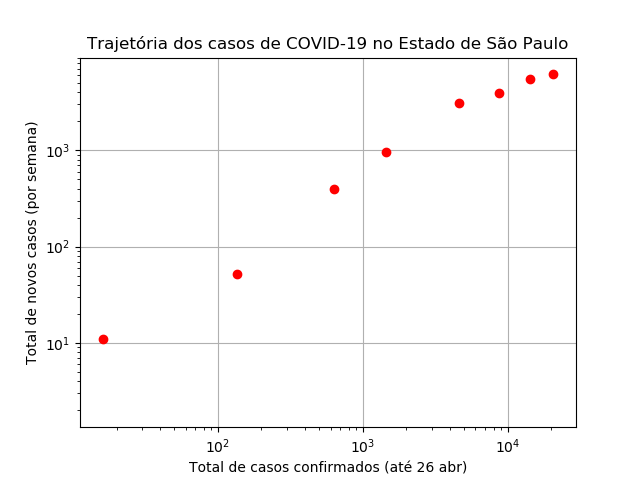

# Trajetória do Covid-19 no Estado de São Paulo
Acompanhamento da trajetória dos casos do Covid-19 no estado de São Paulo usando a metodologia de Aatish Bhatia (https://aatishb.com/covidtrends/).

O site não mostra os casos no Brasil por estado, e achei que seria interessante poder fazer esse acompanhamento para o meu estado.

É difícil visualizar tendências de desaceleração quando estamos no meio da curva exponencial. Portanto, o método proposto utiliza um gráfico relacionando o número total de casos x número de casos novos. Os casos novos são agrupados por semana para desprezar ruídos de variação diária e tornar o gráfico mais nítido, e os eixos são logarítmicos.

Durante o período de crescimento exponencial, o gráfico aproxima-se bastante de uma reta crescente. Conforme a doença desacelera, mesmo que seja uma tendência sutil de achatamento na curva exponencial original, este gráfico vai mostrar a reta curvando-se para a horizontal, e quando os casos começarem a cair, a reta tornará-se decrescente. Vale à pena ver os gráficos de alguns países diferentes no site original para entender melhor o gráfico. Também recomendo muito assistir o vídeo do canal minutephysics a respeito (https://www.youtube.com/watch?v=54XLXg4fYsc).

É importante notar que temos algumas limitações:

1) Gráficos logarítmicos distorcem os dados: uma pequena oscilação na taxa de crescimento da curva exponencial (aquela que aparece nas notícias) causará uma grande variação neste gráfico. Portanto, este gráfico é útil para mostrar tendências, não quantidades absolutas.

2) O programa busca os dados **oficiais** mais recentes no site da Fundação SEADE (https://www.seade.gov.br/coronavirus/) para gerar o gráfico. É sabido que há uma grande quantidade de subnotificação de casos por falta de testes (https://drive.google.com/file/d/1_whlqZnGgvqHuWCG4-JyiL2X9WXpZAe3/view, https://covid19br.github.io/informacoes.html).

> **Atualização dia 22/04/2020:** Foi anunciado hoje que a fila de exames foi zerada em São Paulo, após bastante tempo acumulado. Isso indica 2 coisas: 
> 1) A gente tinha bastante subnotificação (como indicado pelos estudos citados acima);
> 2) A curva deve refletir uma suposta tendência de alta nos próximos dias, por conta das várias confirmações feitas repentinamente. Isso reforça a importância de não utilizar esse gráfico para tirar conclusões sozinho, sem outras fontes de informação. Uma corrida por exames tende a dar a aparência de que a doença acelerou, e simplesmente parar de fazer exames tende a fazer parecer que a doença parou. Olho nas notícias!
> Fontes: https://g1.globo.com/sp/sao-paulo/noticia/2020/04/22/fila-de-testes-de-coronavirus-em-sp-esta-zerada-diz-governo.ghtml, https://www.poder360.com.br/coronavirus/sao-paulo-consegue-zerar-fila-de-espera-de-exames-para-covid-19/

Em suma, esse programa é apenas (mais) uma ferramenta para visualizar as tendências dos dados oficiais em SP. 

Se você é pesquisador, sinta-se à vontade para se modificar ou se inspirar nesse código para fazer outras análises ou estudar outras regiões. 

Se você **não** é pesquisador, evite tirar e espalhar as suas próprias conclusões e confie nos pesquisadores! :)
